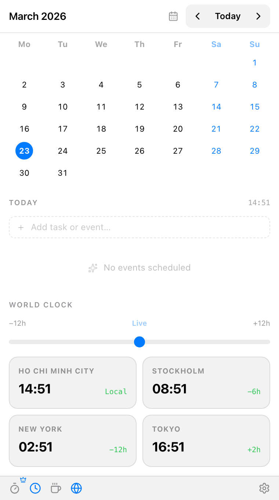

# Daybar — Your day, always one click away.

**Everything Fantastical does. Once, not yearly.**

Daybar is a lightweight macOS menu bar app that unifies your calendar, tasks, and focus tools into a single, seamless experience. Built for professionals who hate context-switching and love beautiful, minimal design.

[**Download for macOS**](https://github.com/vietch2612/daybar-app/releases/latest) | [**Visit Website**](https://daybar.app)

---

## ✨ Visual Tour

| **Unified Timeline** | **Focus & Tasks** |
| :---: | :---: |
|  |  |
| *Events & Tasks in one view* | *Integrated Pomodoro Timer* |

| **World Clock** | **Light Theme** |
| :---: | :---: |
|  |  |
| *Global time scrubber* | *System-matched aesthetics* |

---

## ⚡️ Key Features

### 📅 Unified Timeline
Stop switching between Calendar and Reminders. Daybar interleaves your events and tasks chronologically so you can see exactly what your day looks like at a glance.

### ✅ Built-in Productivity
- **Pomodoro Timer:** Start focus sessions directly on your tasks.
- **Caffeinate:** Keep your Mac awake with a single click during long meetings or downloads.
- **World Clock:** Instantly see time across zones with an interactive scrubber.

### 🚀 Pro Features
- **Meeting Alerts:** Persistent, notch-aware banners for upcoming meetings with one-click "Join" links (Zoom, Meet, Teams).
- **Deep Sync:** Full Google Calendar, Outlook, and iCloud integration.
- **AI Dark Theme:** A high-contrast, beautiful theme designed for focus.

---

## 💎 Pricing: No Subscriptions. Ever.

We believe essential productivity tools shouldn't be a monthly tax.

| Feature | Daybar (Free) | Daybar Pro |
| :--- | :--- | :--- |
| Monthly Calendar Grid | ✅ | ✅ |
| Local Tasks & Timeline | ✅ | ✅ |
| World Clock & Scrubber | ✅ | ✅ |
| Focus Timer & Caffeinate | ✅ | ✅ |
| **Google/iCloud Sync** | ❌ | **✅ Included** |
| **Meeting "Hard Alerts"** | ❌ | **✅ Included** |
| **Price** | **Free** | **$14.99 (Lifetime)** |

---

## 🛡️ Privacy First
Daybar performs no telemetry and has no "cloud" backend. Your tokens and data stay on your machine, encrypted by macOS Keychain.

---

## 🛠 Support & Feedback
- [Report a Bug](https://github.com/vietch2612/daybar-app/issues)
- [Request a Feature](https://github.com/vietch2612/daybar-app/issues)
- [Documentation](https://daybar.app/docs)

---

&copy; 2026 Daybar. macOS is a trademark of Apple Inc.
