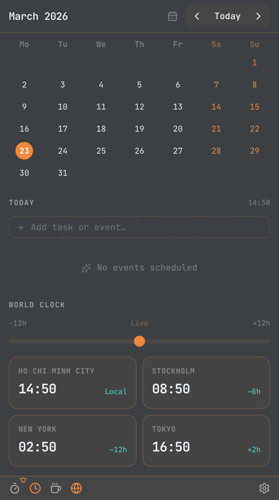
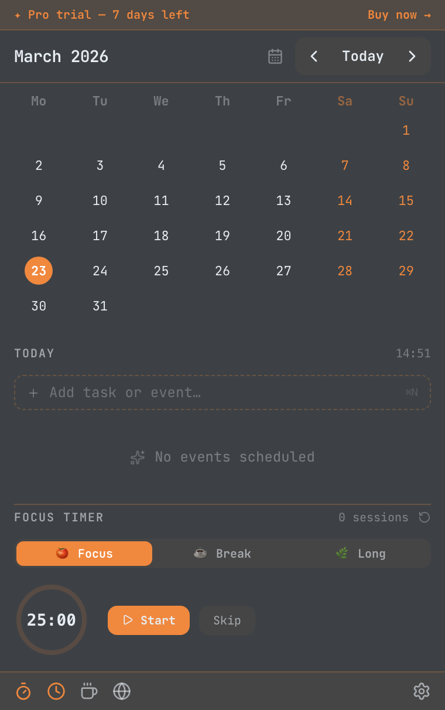
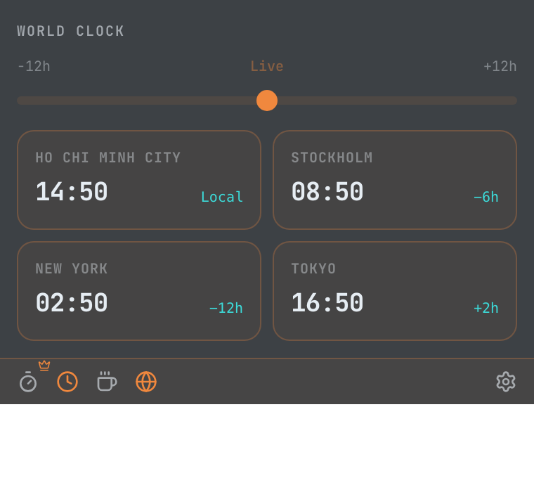

# Daybar

### Your calendar, tasks, and focus tools — one click away in the macOS menu bar

[**daybar.app**](https://daybar.app) · [Releases](https://github.com/vietch2612/daybar-app/releases) · [Issues](https://github.com/vietch2612/daybar-app/issues) · [Privacy](https://daybar.app/privacy)

---

Daybar is a lightweight macOS menu bar app that puts your **calendar, tasks, Pomodoro timer, and world clock** a single click away — without ever leaving what you're working on.

Think Fantastical, but without the annual subscription. $14.99, once, forever.

---

## Screenshots

| | | |
| :---: | :---: | :---: |
|  |  |  |
| *Calendar & Timeline* | *Pomodoro Timer* | *World Clock* |

---

## Features

### 📅 Calendar & Sync
- Monthly grid with week numbers, event dots, and today highlight
- **Google Calendar** — read and write, encrypted token storage
- **Apple Calendar & Reminders** — reads directly from your Mac, no extra account needed
- **Microsoft Outlook** — full sync, supports multiple accounts

### ✅ Tasks & Unified Timeline
- Add tasks from the menu bar with a single keystroke
- **Unified Timeline** — your events and tasks sorted together by time of day
- Check off tasks with one click

### 🌍 World Clock
- View two cities side by side at a glance
- Scrub through time to preview cross-timezone overlap
- 24-hour format

### 🍅 Pomodoro Focus Timer
- Built-in 25/5 Pomodoro timer linked to your task list
- Start a focus session on any task to stay on track
- Live countdown shown in the macOS menu bar

### ☕ Caffeinate
- Prevent your Mac from sleeping — ideal for long calls and downloads
- Presets: 30 min, 1 h, 2 h, or until you turn it off

### 🎨 Themes
- **Auto** — follows macOS Light / Dark system setting automatically
- **Light** and **Dark** — clean, minimal, distraction-free
- **AI Dark** *(Pro)* — high-contrast dark theme with JetBrains Mono and a signature orange accent

### 🔔 Persistent Meeting Alerts *(Pro)*
- A banner appears on screen when a meeting is about to start — you won't miss it
- One-click **Join** for Zoom, Google Meet, and Microsoft Teams

---

## Free vs Pro

| Feature | Free | Pro |
| :--- | :---: | :---: |
| Monthly calendar grid | ✅ | ✅ |
| Local tasks + unified timeline | ✅ | ✅ |
| World clock + time scrubber | ✅ | ✅ |
| Pomodoro focus timer | ✅ | ✅ |
| Caffeinate | ✅ | ✅ |
| Auto / Light / Dark themes | ✅ | ✅ |
| Launch at login | ✅ | ✅ |
| Google Calendar sync | ❌ | ✅ |
| Apple Calendar & Reminders | ❌ | ✅ |
| Outlook Calendar | ❌ | ✅ |
| AI Dark theme | ❌ | ✅ |
| Persistent meeting alerts | ❌ | ✅ |
| **Price** | **Free** | **$14.99 (Lifetime)** |

No subscription. No renewal. Pay once, own it forever.

[**Get Daybar Pro →**](https://daybar.app/#pricing)

---

## Privacy

Daybar has **no telemetry and no cloud backend**. Your calendar data never leaves your machine. OAuth tokens for Google and Outlook are encrypted and stored in the macOS Keychain — the same secure store that protects your passwords.

[Read the full Privacy Policy →](https://daybar.app/privacy)

---

## System Requirements

- macOS 12 Monterey or later
- Apple Silicon (M1 and later) and Intel — both supported

[**Download the latest release →**](https://github.com/vietch2612/daybar-app/releases/latest)

---

## Support & Feedback

- [**Report a Bug**](https://github.com/vietch2612/daybar-app/issues/new?labels=bug)
- [**Request a Feature**](https://github.com/vietch2612/daybar-app/issues/new?labels=enhancement)
- [**Documentation**](https://daybar.app/docs)
- Email: support@daybar.app

---

## Roadmap

- [ ] Natural language event creation ("lunch with Sarah tomorrow at noon")
- [ ] Multiple Google account support
- [ ] Live meeting countdown in the menu bar ("Standup · 3m")
- [ ] Daily agenda morning notification
- [ ] Customizable world clock cities
- [ ] Week view with time-block layout
- [ ] Event write-back to all calendar providers
- [ ] macOS Notification Center widgets
- [ ] Windows support

Have a feature request? [Open an issue →](https://github.com/vietch2612/daybar-app/issues)

---

&copy; 2026 Daybar. macOS is a trademark of Apple Inc.
