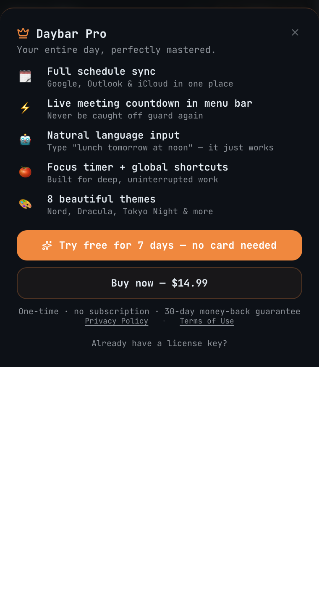
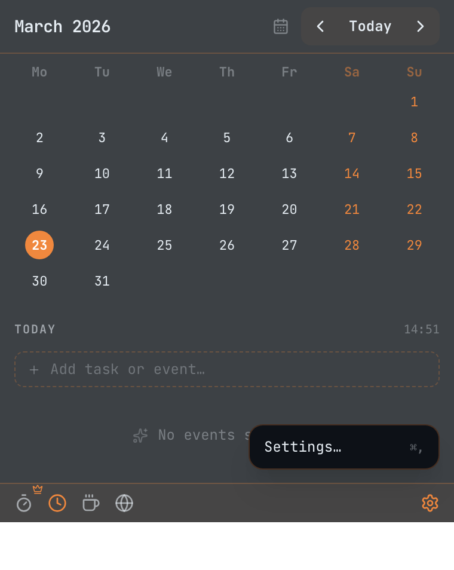

# Daybar — Your day, always one click away.

**macOS menu bar app for calendar, tasks, Pomodoro timer & world clock**

[**daybar.app**](https://daybar.app) · [Download](https://github.com/vietch2612/daybar-app/releases/latest) · [Report a Bug](https://github.com/vietch2612/daybar-app/issues) · [Request a Feature](https://github.com/vietch2612/daybar-app/issues)

---

Daybar is a lightweight macOS menu bar app that unifies your **calendar, tasks, and focus tools** into a single, always-available popup — without switching apps or losing context.

One click. Your entire day.

> **No subscriptions. No monthly fees. $14.99 one-time Pro license.**

---

## Screenshots

| Unified Timeline | Focus Timer |
| :---: | :---: |
|  |  |
| *Events & tasks in one view* | *Pomodoro timer with task integration* |

| World Clock | Light Theme |
| :---: | :---: |
|  |  |
| *Interactive global time scrubber* | *System-matched light theme* |

| Pro Sheet | Settings |
| :---: | :---: |
|  |  |
| *Simple one-time purchase* | *Clean sidebar settings* |

---

## Features

### 📅 Calendar & Sync
- Monthly grid with week numbers, event dots, and today highlight
- **Google Calendar** — full read + write, PKCE-protected OAuth
- **Apple Calendar & Reminders** — native bridge, no account needed
- **Microsoft Outlook Calendar** — Azure OAuth, multi-account

### ✅ Tasks & Timeline
- Quick-add tasks from the menu bar in one keystroke
- **Unified Timeline** — events and tasks sorted chronologically side-by-side
- Check off tasks with a single click

### 🌍 World Clock
- See two cities at a glance
- Drag the time scrubber to preview cross-timezone overlap
- 24-hour format

### 🍅 Pomodoro Focus Timer
- 25/5 Pomodoro sessions tied to your task list
- Start a focus session on any task — stay in context
- Live countdown in the macOS menu bar while focused

### ☕ Caffeinate
- Prevent your Mac from sleeping — great for long calls and downloads
- Choose duration: 30 min, 1 h, 2 h, or indefinite

### 🎨 Themes
- **Auto** — follows macOS Light / Dark system preference
- **Light** and **Dark** — clean, minimal, distraction-free
- **AI Dark** *(Pro)* — high-contrast dark with JetBrains Mono + orange accent

### 🔔 Hard Meeting Alerts *(Pro)*
- Persistent notch-aware banner when a meeting is starting
- One-click **Join** for Zoom, Google Meet, and Microsoft Teams

---

## Free vs Pro

| Feature | Free | Pro |
| :--- | :---: | :---: |
| Monthly calendar grid | ✅ | ✅ |
| Local tasks + unified timeline | ✅ | ✅ |
| World clock + scrubber | ✅ | ✅ |
| Pomodoro focus timer | ✅ | ✅ |
| Caffeinate | ✅ | ✅ |
| Auto / Light / Dark themes | ✅ | ✅ |
| Launch at login | ✅ | ✅ |
| Google Calendar sync | ❌ | ✅ |
| Apple Calendar & Reminders | ❌ | ✅ |
| Outlook Calendar | ❌ | ✅ |
| AI Dark theme | ❌ | ✅ |
| Hard meeting alerts | ❌ | ✅ |
| **Price** | **Free** | **$14.99 (Lifetime)** |

[**Get Daybar Pro →**](https://daybar.app/#pricing)

No subscription. No renewal. Pay once, own it forever.

---

## Privacy

Daybar has **no telemetry and no cloud backend**. All OAuth tokens are stored encrypted in the macOS Keychain via `safeStorage`. Your calendar data never touches our servers.

[Privacy Policy →](https://daybar.app/privacy)

---

## Download

**[Download the latest release →](https://github.com/vietch2612/daybar-app/releases/latest)**

Requires macOS 12 Monterey or later. Apple Silicon (arm64) native.

---

## Support

- [Report a Bug](https://github.com/vietch2612/daybar-app/issues)
- [Request a Feature](https://github.com/vietch2612/daybar-app/issues)
- [Documentation](https://daybar.app/docs)
- Email: support@daybar.app

---

## Roadmap

- [ ] Natural language event creation ("lunch with Sarah tomorrow at noon")
- [ ] Multiple Google account support
- [ ] Meeting countdown in tray ("Standup · 3m")
- [ ] Daily agenda morning notification
- [ ] Customizable world clocks
- [ ] Event write-back to all calendar providers
- [ ] macOS Notification Center widgets
- [ ] Windows support

Vote on features or suggest new ones → [GitHub Issues](https://github.com/vietch2612/daybar-app/issues)

---

&copy; 2026 Daybar. macOS is a trademark of Apple Inc.
